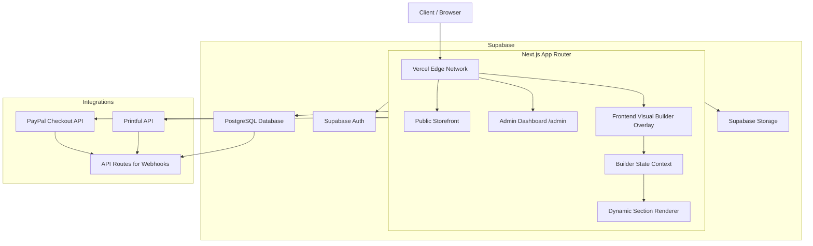

# E-Commerce Architecture Design: Dashboard + Visual Builder

This document outlines the architecture for a modern e-commerce platform featuring both a traditional admin dashboard and a frontend visual website builder, powered by Next.js, Supabase, and deployed on Vercel.

## 1. Full Architecture Diagram



## 2. Database Schema (Supabase PostgreSQL)

```sql
-- Users and Roles
CREATE TABLE users (
    id UUID PRIMARY KEY REFERENCES auth.users,
    email TEXT UNIQUE NOT NULL,
    role TEXT DEFAULT 'customer' CHECK (role IN ('customer', 'admin')),
    created_at TIMESTAMPTZ DEFAULT NOW()
);

-- E-commerce Core
CREATE TABLE products (
    id UUID PRIMARY KEY DEFAULT gen_random_uuid(),
    title TEXT NOT NULL,
    description TEXT,
    price DECIMAL(10,2) NOT NULL,
    printful_id TEXT,
    active BOOLEAN DEFAULT true,
    created_at TIMESTAMPTZ DEFAULT NOW()
);

CREATE TABLE collections (
    id UUID PRIMARY KEY DEFAULT gen_random_uuid(),
    title TEXT NOT NULL,
    slug TEXT UNIQUE NOT NULL
);

CREATE TABLE product_images (
    id UUID PRIMARY KEY DEFAULT gen_random_uuid(),
    product_id UUID REFERENCES products(id) ON DELETE CASCADE,
    url TEXT NOT NULL,
    alt_text TEXT,
    is_main BOOLEAN DEFAULT false,
    created_at TIMESTAMPTZ DEFAULT NOW()
);

CREATE TABLE orders (
    id UUID PRIMARY KEY DEFAULT gen_random_uuid(),
    user_id UUID REFERENCES users(id),
    status TEXT DEFAULT 'pending',
    total DECIMAL(10,2) NOT NULL,
    paypal_order_id TEXT,
    printful_order_id TEXT,
    created_at TIMESTAMPTZ DEFAULT NOW()
);

-- CMS & Builder Engine
CREATE TABLE pages (
    id UUID PRIMARY KEY DEFAULT gen_random_uuid(),
    slug TEXT UNIQUE NOT NULL,
    title TEXT NOT NULL,
    status TEXT DEFAULT 'published' CHECK (status IN ('draft', 'published')),
    created_at TIMESTAMPTZ DEFAULT NOW()
);

CREATE TABLE section_settings (
    id UUID PRIMARY KEY DEFAULT gen_random_uuid(),
    page_id UUID REFERENCES pages(id) ON DELETE CASCADE,
    type TEXT NOT NULL, -- e.g., 'hero', 'product-grid'
    sort_order INTEGER NOT NULL,
    content JSONB DEFAULT '{}'::jsonb, -- Stores text, image urls, specific settings
    created_at TIMESTAMPTZ DEFAULT NOW()
);

CREATE TABLE theme_settings (
    id UUID PRIMARY KEY DEFAULT gen_random_uuid(),
    colors JSONB DEFAULT '{"primary": "#000", "secondary": "#fff"}',
    typography JSONB DEFAULT '{"fontFamily": "Inter", "headingSize": "2rem"}',
    layout JSONB DEFAULT '{"containerWidth": "1200px"}'
);

CREATE TABLE media_library (
    id UUID PRIMARY KEY DEFAULT gen_random_uuid(),
    url TEXT NOT NULL,
    alt_text TEXT,
    uploaded_by UUID REFERENCES users(id),
    created_at TIMESTAMPTZ DEFAULT NOW()
);
```

## 3. Next.js Component Structure

```
app/
├── (public)/              # Standard storefront routes
│   ├── page.tsx           # Dynamically renders sections based on page slug
│   ├── [slug]/page.tsx    # Dynamic pages
│   └── layout.tsx         # Includes the <BuilderOverlay /> (conditionally rendered)
├── admin/                 # Traditional Admin Dashboard
│   ├── page.tsx           # Dashboard home
│   ├── products/          # Data management
│   ├── orders/            
│   └── settings/          
├── api/                   # Serverless Functions
│   ├── webhooks/
│   │   ├── paypal/route.ts
│   │   └── printful/route.ts
│   └── builder/
│       └── save/route.ts
components/
├── builder/               # Builder UI & Logic
│   ├── BuilderOverlay.tsx # Main wrapper for admin builder
│   ├── Toolbar.tsx        # Floating toolbar
│   ├── InlineEditor.tsx   # Wrapper for editable text
│   └── MediaManager.tsx   # Image selector modal
├── sections/              # Renderable modular sections
│   ├── HeroSection.tsx
│   ├── ProductGrid.tsx
│   └── TextBlock.tsx
└── ui/                    # Base components (buttons, inputs)
lib/
├── supabase/              # Client & Server DB wrappers
├── printful.ts            # Printful API wrapper
└── paypal.ts              # PayPal integration
```

## 4. Admin Builder UI System

The builder operates as an overlay on top of the live website, activated when `user.role === 'admin'` and `builder_mode === true` (stored in cookies or local state).

### Core Components:
- **Floating Toolbar**: Fixed to the bottom or side, containing:
  - Add Section (+)
  - Design Settings (Global Theme)
  - Page Structure (Drag & drop list of active sections)
  - Undo/Redo (using a local state history stack)
  - Save Draft / Publish
- **Inline Editing**: Text elements are wrapped in an `<InlineEditor>` component. When in builder mode, `contentEditable` is set to true. Changes are tracked in a global builder state context (`Zustand` or React Context).
- **Section Controls**: Hovering over a section reveals a small floating menu to move up/down, edit background/padding, or delete the section.
- **Media Manager**: Clicking an image opens a modal reading from `media_library` or Supabase Storage bucket for drag-and-drop uploads.

## 5. Printful API Integration Logic

- **Product Sync**: Admin dashboard triggers a sync. Next.js API route calls `GET /store/products` from Printful, and upserts them into the Supabase `products` table.
- **Order Forwarding**: When an order is completed (confirmed by PayPal), a background function (or edge function) formats the order payload and POSTs to Printful's `/orders` API.
- **Webhooks**: An API route `/api/webhooks/printful` listens for shipment updates (`package_shipped`). It updates the order status in Supabase and triggers an email to the customer.

## 6. PayPal Checkout Flow

1. **Cart**: User adds items, proceeds to `/checkout`.
2. **Order Creation**: Frontend calls `/api/paypal/create-order` -> calls PayPal API -> Returns `orderID`.
3. **Approval**: User approves payment via PayPal modal.
4. **Capture**: Frontend calls `/api/paypal/capture-order` with the `orderID`.
5. **Fulfillment**: 
   - Backend verifies payment.
   - Saves order to Supabase.
   - Forwards to Printful.
   - Clears user cart.
   - Redirects to `/checkout/success`.

## 7. GitHub Project Structure & Workflow

- **Branch Strategy**:
  - `main`: Production branch.
  - `staging`: Pre-production testing.
  - `feature/*`: Individual feature branches.
- **Workflow**:
  - Developers push to `feature/*`.
  - Open PR to `staging`. GitHub Actions runs linting, type-checking, and Playwright E2E tests.
  - Merge to `main` triggers production Vercel deployment.

## 8. Vercel Deployment Setup

- **Edge Optimization**: Use Vercel Edge functions for the builder middleware (to check auth cookies instantly and inject builder mode state) and lightweight API routes.
- **Image Optimization**: Use Next.js `<Image>` component, automatically optimized by Vercel's image CDN.
- **Caching & ISR**: Storefront pages use Next.js App Router caching (`fetch` with caching) or ISR. When the admin hits "Publish" in the builder, a Server Action calls `revalidatePath('/')` to instantly clear the cache for that specific page.

## 9. Security Best Practices

- **Builder Access**: 
  - Middleware checks for a valid Supabase Auth session and verifies the `role` claim.
  - API routes for saving builder changes verify the JWT token server-side before interacting with Supabase.
  - Builder JS bundles are dynamically imported (`next/dynamic`) only if the user is an admin, ensuring zero bundle size impact for regular users.
- **RLS (Row Level Security)**:
  - `section_settings`: `SELECT` is public. `INSERT/UPDATE/DELETE` requires `auth.uid() IN (SELECT id FROM users WHERE role = 'admin')`.
  - `orders`: Users can only `SELECT` their own orders. Admins can see all.
